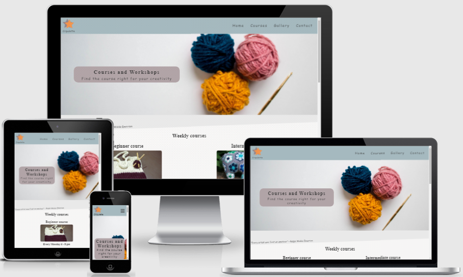
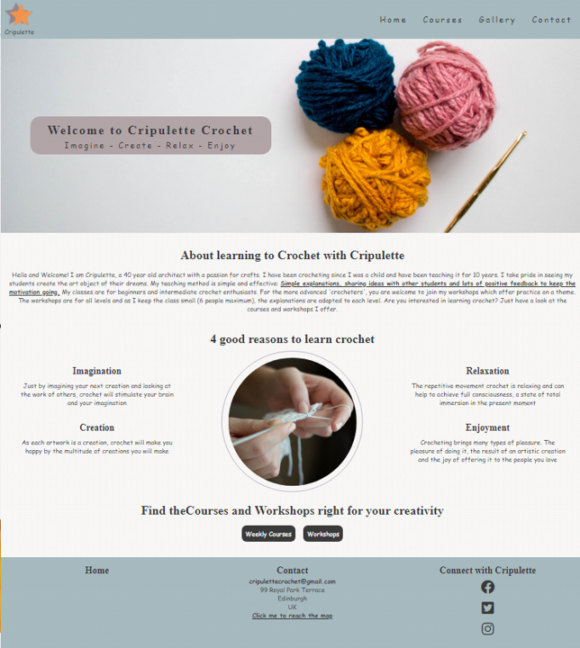
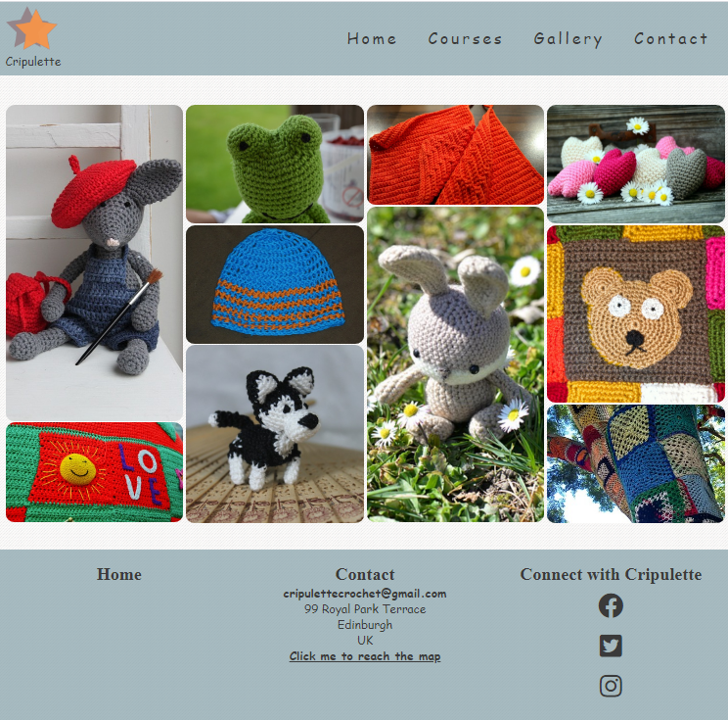
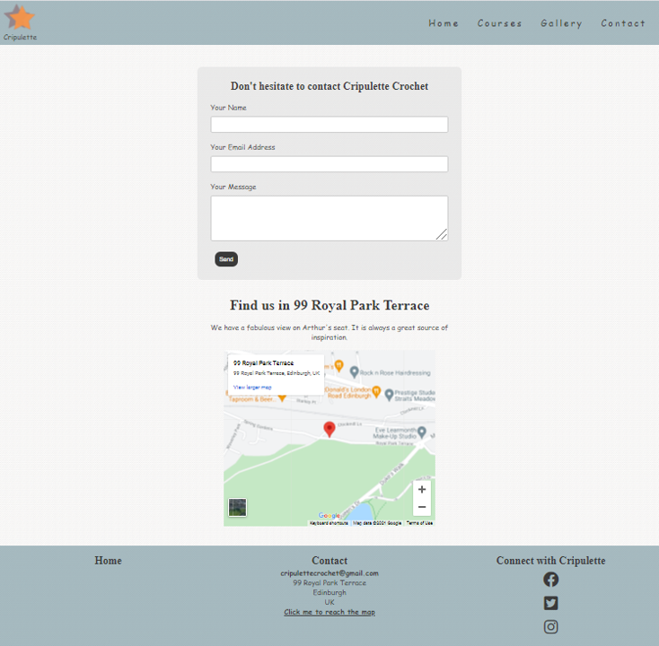
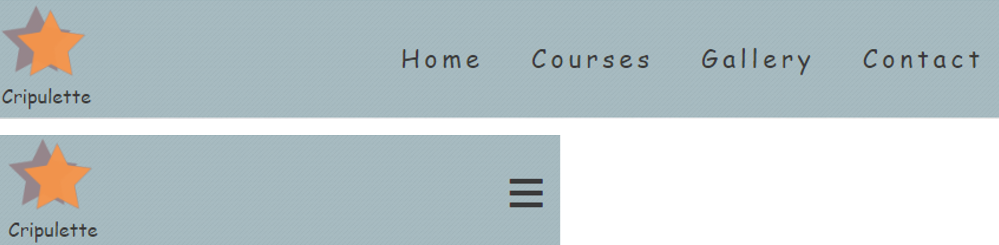
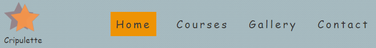
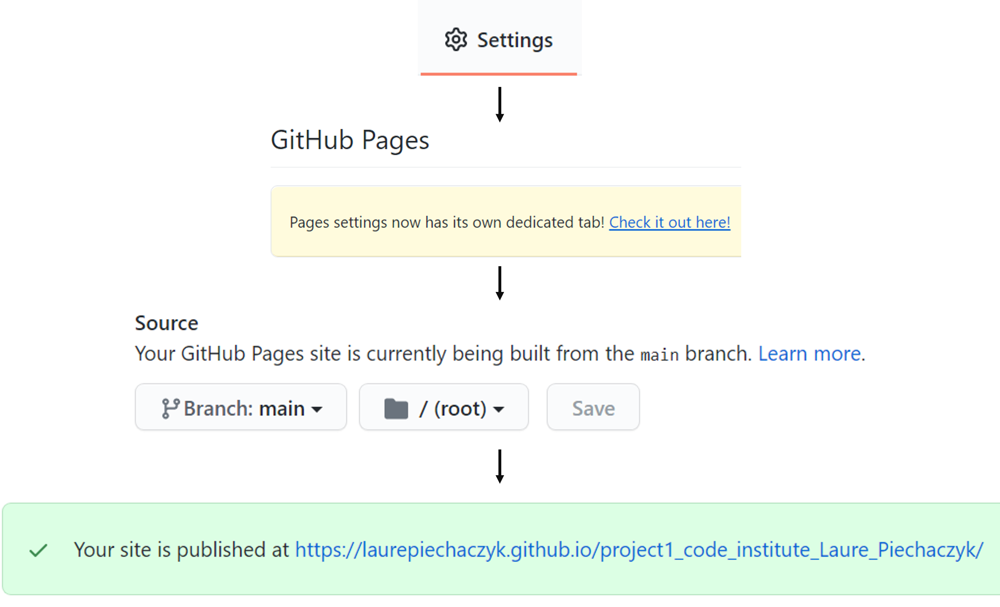

<h1 align="center"> Project 1 for Code Institute formation | Cripulette Crochet - HTML & CSS</h1>

[View the live project here.](https://laurepiechaczyk.github.io/project1_code_institute_Laure_Piechaczyk/)

Cripulette Crochet is a website built as part of a project for the [code institute](https://codeinstitute.net/) (training to become a web developer) to develop and show my skills in HTML and CSS. 

To do this, I invented a small business that offers courses and workshops to learn crochet.

<h3 align="center"></h3>

# Table of content

Open the Table of Contents here

[About The Project](#about-the-project) 

[Target audience](#target-audience)  

[User Experience](#user-experience)
- [User stories](#user-stories)
- [Visitor Goals](#visitor-goals)
- [Main design choices](#main-design-choices)
- [Wireframes](#wireframes)

[Features](#features)  
- [Composition of the website](#composition-of-the-website)
- [Responsiveness](#responsiveness)
- [Animations](#animations)
- [Position of elements and geometric shapes](#position-of-elements-and-geometric-shapes)

[Technologies used](#technologies-used)
- [Languages used](#languages-used)
- [Frameworks and Programs used](#frameworks-and-programs-used)

[Credits](#credits)
- [Inspiration credits](#inspiration-credits)
- [Code credits](#code-credits)
- [Read me file credits](#read-me-file-credits)
- [Pictures credits](#pictures-credits)
- [General websites credits](#general-websites-credits)

[Tests](#tests)
- [Code validation and issues found](#code-validation-and-issues-found)
- [Test on browsers](#test-on-browsers)
- [Test on devices](#test-on-devices)

[Deployment](#deployment) 

[What could have been made better](#What-could-have-been-made-better)

[Conclusion](#conclusion)

[Acknowledgments](#acknowledgments)

# About the project 
In order to practice, develop and demonstrate my HTML and CSS skills, I created the responsive website Cripulette Crochet. Cripulette Crochet is an invented small company that offers courses and workshops to learn crochet. 
I have chosen this theme because I crochet myself and I deeply believe that in our computer-driven world, we should all make time for handmade creations.

Nevertheless, the main objective of this site is to train with HTML and CSS. For this reason, I made the decision to use these two languages almost exclusively. I also chose to avoid using Bootstrap because I wanted to learn and consolidate my ability to write CSS code and control all the elements. I used a little bit of JavaScript for some functionalities but focused on HTML and CSS.

# Target audience
The target audience of Cripulette Crochet is adults who crochet or want to learn to crochet. The site offers courses and workshops to learn and improve crochet as well as to find new inspiration by making creations on various themes.

I expect this site to be exchanged between "crocheters" by sending the link to each other as word of mouth is important among crocheters. However, the site is also aimed at people who are looking for crochet classes/workshops in their neighborhood, even if they don't know anyone.

# User Experience

## User stories
The target users are adults who enjoy doing crafts such as crocheting, knitting and sewing. They are likely to have some of the following characteristics:
1. They like to create and express themselves through small pieces of art that they have created themselves.
2. They are persistent in their work and are not afraid to spend time on a project to complete it.
3. They are patient and enjoy spending hours doing activities in a quiet environment. 
4. They are willing to improve their skills. 
5. They are keen to meet other people who share the same hobby. 
6. They like or need to cut themselves off from the digital world.

This last point made me raise an interesting question: How do you attract people who might want to avoid the media by using the media? 

So, I built the site with this in mind and made design choices that seemed relevant to allow users to feel in a calm and welcoming environment when browsing the site.

## Visitor Goals
1. To feel calm and stay relax.
2. Find the offers/information rapidly.
3. Get motivation and inspiration even if the user does not register for a course.
4. That the user like the website and offers enough to share it with friends. 

## Main design choices
- ### Theme Colors
  Theme colors were inspired from palettes that offer a calm feeling (details in credits) while stimulating the curiosity and thus the creativity by adding Yellow-Orange colors.

- ### Background
  A background image has been added to give a 3D feel and to give the feeling that the background can be touched. I expect many users like to touch fabrics and surfaces so I added a background that gives that feeling.
  For visual cohesion, the image was also used for the headings and footer and the top colors were transparent at 0.7 to allow subtle viewing of the background image.
        
- ### Pictures
  1. #### Homepage
     For the design of the homepage, I wanted to focus on the process of creation and not on a final creation. That is why I have chosen images showing wool, hooks and the process of making crochet.
     The reason is that I did not want to influence the user's imagination on the homepage.

  2. #### Courses and Workshops
     For this page, I have tried to choose photos that illustrate the proposed course and workshop.  

  3. #### Gallery
     I have tried to illustrate the diversity of creations that can be made with crochet as well as the different technical levels of creations. As I used royalty free images, I was limited in the images I could use and I think the diversity of crochet could have been better illustrated.

- ### Fonts
  The Cursive font was chosen for the body text on large and medium-sized screens because it gives the impression of handwriting, which I suppose is attractive to people looking for manual activities. For small screens such as phones, the Roboto font was used for readability reasons. After testing the site on a phone, I realized that the Cursive font was difficult to read. I therefore opted for the more readable Roboto font, as I felt that the accessibility to the information was more important than the aesthetics and feel of handwriting.
  The Serif font was chosen for the headlines because I find its combination with the Cursive font pleasant. Moreover, this combination gives, in my opinion, a clean look with an artistic touch.

- ### Interactivity, animations and geometric shapes
  Little interactivity and animation were added to the website to keep it simple and relaxing. Some shapes containing phrases from famous artists were displayed in a non-straight position to attract readers' attention, but the site was kept simple.

- ### Border-radius
  The radii of the edges have been rounded to give a more tranquil feel.

## Wireframes
to add a link here

# Features 

## Composition of the website
The site is structured in 4 web pages with a link on the navbar + 1 page (calendar) accessible only from the "Courses" page. Some links have been strategically placed to allow easy navigation to the relevant sub-sections. e.g. Weekly courses button on the homepage.

- ### Landing page
The landing page consists of a header, followed by a cover with a background image, 3 sections and a footer.
The purpose of this page is to introduce Cripulette crochet (section "about"), to give a motivation to learn crochet (section "4 good reasons to learn crochet") and to place a link so that the user can intuitively access the information (section "link to the courses" + header + footer).

Picture of the landing page here

<h3 align="center"></h3>

- ### Courses & Calendar pages
The Courses page consists of a header, followed by a cover with a background image, 3 sections and a footer. Before each section, there is a separation containing a sentence by a famous person.
The purpose of this page is to present the courses and workshops offered by Cripulette Crochet. The last section is a link to a google calendar  were users can find the courses in a calendar layout. The page with the calendar consist od a header, followed by a div to display the calendar and a footer. This page opens in a new tab to allow the user to navigate easily.

Pictures of the Courses and Calendar pages here

<h3 align="center"></h3>

- ### Gallery page
The Gallery page consists of a header, followed by a div containing images and a footer.
The purpose of this page is to show various crochet creations to give inspiration and motivation to the users.

Picture of the Gallery page here

<h3 align="center"></h3>

- ### Contact page
The contact page consists of a header, followed by two sections and a footer.
The purpose of this page is to allow the users to send a message and find the localisation of the courses and workshops using google map.

Picture of the Contact page here

<h3 align="center"></h3>

- ### Navbar & Footer
The purpose of the navigation bar and footer is to allow the user to navigate easily between pages and sections of the website. The footer also contains links to relevant social media sites that open in a new tab to allow the user to navigate easily.

## Responsiveness
The website is designed to be suitable for all devices. For example, the responsive navigation bar turns into a burger button for phone screens.
Moreover, the text in some sections has been modified to suit the screen size. This was done to provide more complete information for computer users while allowing phone users to focus on the main information.
<h3 align="center"></h3>

## Animations
For design reasons, there is very little animation on this site. To make it easier for the user to navigate, the background color and the padding of the links in the navigation bar change when the mouse passes over them.

<h3 align="center"></h3>
  
The background color of the buttons for the price and details on the courses web page change within the first 6 seconds of the page loading. I expect that this animation will be noticed mainly by people who browse the website quickly and expect to reach the detailed information quickly.

## Position of elements and geometric shapes
Care has been taken to position the elements in the different screen sizes. In the Courses and Workshops page, geometric shapes containing famous quotes have been used as separators between sections.
<h3 align="center"></h3>
    
# Technologies used
## Languages used
-   [HTML5](https://en.wikipedia.org/wiki/HTML5)
-   [CSS3](https://en.wikipedia.org/wiki/Cascading_Style_Sheets)  
-   [js](https://en.wikipedia.org/wiki/JavaScript)  

## Frameworks and Programs used
- [Google Fonts](https://fonts.google.com/) | used to  import the 'Roboto' font

- [Google Maps](https://www.google.co.uk/maps) | used to display a map

- [Google Calendar](https://calendar.google.com/) | used to display a calendar

- [Font Awesome](https://fontawesome.com/) | used to add icons representing social media in the footer

- [Git](https://git-scm.com/) | used as version control system

- [Gitpod](https://gitpod.io/workspaces) | used to code, commit to git and push the codes to github

- [GitHub](https://github.com/) | used to store the project code, show it and deploy the website

- [Balsamiq](https://balsamiq.com/) |  used to create the wireframe

- [Inkscape](https://inkscape.org/) | used to create the logo

- [Spark.adobe](https://spark.adobe.com/tools/image-resize/) | used to resized pictures

- [Powerpoint](https://simple.wikipedia.org/wiki/Microsoft_PowerPoint) | used to create images from screenshots

- [Word](https://en.wikipedia.org/wiki/Microsoft_Word) | used to correct the grammar

- [am I responsive?](http://ami.responsivedesign.is/) | used to look at the responsiveness of the website and to present an introductory picture in the readme file

- [W3C Markup Validation Service](https://validator.w3.org/) | used to check the validity of the HTML code

- [W3C CSS Validation service](https://jigsaw.w3.org/css-validator/) | used to check the validity of the CSS code

- [Colorrrs](https://www.webfx.com/web-design/hex-to-rgb/) | used to convert hex color to rgb color

- [Chrome DevTools](https://developer.chrome.com/docs/devtools/) | used to inspect the elements, codes and to see the how the site look like on various phones and tablets

- [Clippy](https://bennettfeely.com/clippy/) | used to get rapidly codes to design forms with clip-path

- [DeepL](https://www.deepl.com/) |  used to translate words from French to English and to write the content of the website and the 'Read me' file

# Credits
## Inspiration credits
- ### Theme Colors
   The colors of the theme were inspired by the palettes :  [Del Rio Gray Iceberg Powder Blue Color Palette](https://colorideas.net/del-rio-gray-iceberg-powder-blue-color-palette/) and [iColorpalette](https://icolorpalette.com/imagepalette/color-palette-ideas-from-horizon-sky-shore-image-2).

   I was inspired by these palettes because they give an overall sense of calm and the addition of the color orange stimulates curiosity and therefore creativity.

- ### Sections of the webpage
   The "4 good reasons to learn crochet" section and gallery were inspired by a walkthrough project with [code institute](https://codeinstitute.net/) called love running.

- ### Website content
   Some of the content of the website was inspired by [ammoniteyarns](https://www.ammoniteyarns.co.uk/).

## Code credits
[code institute](https://codeinstitute.net/) - Parts of the code throughout the website have been adapted from the courses, the walkthrough project called love running and the [SampleREADME](https://github.com/Code-Institute-Solutions/SampleREADME).

[Udemy course by Enzo Ustariz](https://www.skillshare.com/classes/10-techniques-%C3%A0-conna%C3%AEtre-en-CSS/2090817304) - Some codes for positioning the elements have been adapted from this course.

[w3schools](https://www.w3schools.com/) - Used throughout the project. The responsive burger menu is a code adapted from
[howto_js_mobile_navbar](https://www.w3schools.com/howto/howto_js_mobile_navbar.asp).

[stakocverflow](https://stakocverflow.com/) - Used throughout the project.

## Read me file credits
As this is the first 'Readme' file I have ever written, I've read files of many students who were kind enough to share their first projects.
The 'Readme' file from [LogisticBravo](https://github.com/LogisticBravo/Milestone_Project-1-3DPrintQ) was a great source of inspiration. I have also used the template from [othneildrew](https://github.com/othneildrew/Best-README-Template) and as well as one from [Code Institute](https://github.com/Code-Institute-Solutions/readme-template).

## Pictures credits
Pictures were taken from [Pixabay](https://pixabay.com/) and [Unsplash](https://unsplash.com/). The backgroung picture was taken from [Toptal](https://www.toptal.com/designers/subtlepatterns/?s=striped_lens).
- ### cover:
    - Three balls wool: Unsplash by Karen Penroz. 
- ### Homepage:
    - making crochet: Pixabay by julia234   
- ### Courses:
    - Bag-beginner: Pixabay by xxolaxx
    - rinoceros intermediaire: Pixabay by leoleobobeo
    - dragon for Keep your inner child alive: Pixabay by holmespj
    - Kid_slipper: Pixabay by sato1mo
    - Hat: Unsplash by Dana
- ### Gallery:
    - pablo-mouse: Pixabay by CarlaBron
    - wool: Pixabay by congerdesign
    - cap: Pixabay by Efraimstochter
    - frog: Pixabay by jirmanovakristyna
    - husky: Pixabay by simonegmoreira
    - oven-mitts: Pixabay by Hans
    - easter-bunny: Pixabay by HOerwin56
    - hearts: Pixabay by congerdesign
    - hand-labor: Pixabay by lovini
    - tree: Pixabay by graceful
   
## General websites credits
citations: [ACNNJ](https://artcenter-nnj.org/10-famous-quotes-about-art/)

# Tests
## Code validation and issues found
On 25 July 2021, all pages were checked with [W3C Markup Validation Service](https://validator.w3.org/) and [W3C CSS Validation service](https://jigsaw.w3.org/css-validator/) and no error were found.
However, the code has been tested before and found to have issues. 
With regard to the verification of the HTML code, two duplicate tags had to be removed and the iframe tags used to link google mag and google calendar had to be corrected, as advised by the [W3C Markup Validation Service](https://validator.w3.org/).
The css checker revealed an erroneous link to google fonts which has been removed.

## Test on browsers
The website was tested on computers using the browsers:
- [Google Chrome](https://en.wikipedia.org/wiki/Google_Chrome)
- [Firefox](https://en.wikipedia.org/wiki/Firefox) 
- [internet explorer](https://en.wikipedia.org/wiki/Internet_Explorer)
- [Microsoft edge](https://en.wikipedia.org/wiki/Microsoft_Edge)
- [Safary](https://en.wikipedia.org/wiki/Safari_(software))

## Test on devices
[Chrome DevTools](https://developer.chrome.com/docs/devtools/) was used to see how the site looks like on various phones and tablets. Additionally, after deployement the website was tested on various phones: iphone11, iphone10, Samsung Galaxy A3.

# Deployment
The website has been deployed with github. The project was stored in github.
- In the Github repository:
    - Go to Settings
    - Then GitHub Pages
    - Select Branch main
    - Save
    - Visit the website by following the link
<h3 align="center"></h3>

# What could have been made better 
## Organization before starting to code
- ### Finding a theme 
    It took me a long time to decide on the theme because I hesitated between continuing a previous project on language learning and starting a new project from scratch. After starting using my previous project, I finally changed my mind and started a new project. The reason is that in order to learn well, I thought (and still think) that it is very formative to do the project from scratch so that I understand well the basics of building a website in HTML and CSS. Nevertheless, this back and forth has caused me to spend time on a project I am not using now and I think I should have started directly with the new project.

- ### Starting to code
    I was very keen to get my project off the ground quickly. Thus, after having decided on my new project, I designed the Wireframe and really rapidly started to code. I received the very justified remark that I used a lot of ids and that it might be better to limit the number of ids especially when working in a team. I realized that I could have taken more time at the beginning of the project reflecting on how I could organize the code as well as reflecting in advance about classes that could be used for similar elements. I believe this would have resulted in cleaner code. 

- ### Order for writing the code for the project
    Rather instinctively, I coded the site for widescreens and then worked on making it responsive. I could have done the responsiveness in parallel with the coding for the large screens as my mentor pointed out to me very well. It is true that this could have avoided making changes for the phones that affected the layout of the elements for the large screens.

## Fonts
The original fonts chosen from the google font site were: 'Sacramento' and 'Josefin Slab'. However, I made a mistake when I copied the link, and did not work with these fonts. I realized towards the end of the project the error, corrected the link but realized I preferred the previous fonts and so deleted the link for the 'Sacramento' and 'Josefin Slab' fonts. I honestly think I should have seen this error earlier or at least checked that I was using the correct font at an earlier stage.

## Small modification from the wireframe
The wireframe designed for the project was not followed 100%. One of the reasons is that after coding to follow the wireframe, I realised that in my opinion it did not look nice or clean. An example is the workshop section (in the webpage "Courses") for the middel size screens. It was planned to keep the three workshops on the same line. However, as the text is a bit long, this was not aesthetically pleasing and I thus decided to put only one workshop on each line. Other changes were the burger menu for the phones and the link to the google calendar. These changes were made following a meeting with my mentor who advised me to use them and as I thought the ideas were relevant I followed them.

## Design 
While doing this project I thought a lot about the web design profession and had a lot of admiration for their work. I did my best to code a website to look nice but I am sure it could have been improved by a web designer. 

# Conclusion
This project has deepened and consolidated my knowledge of HTML and CSS. I also hope that it shows that I have a good foundation in these languages.

Having previous knowledge of coding language for analyzing data from a scientific background + basic knowledge of CSS using mostly bootstrap, I was expected to handle CSS quickly. However, I found that although the logic of CSS seemed easy at first, the reality of using it and controlling all the elements was quite complex. It requires, in my opinion, a deep attention to detail and a very good knowledge of a huge amount of CSS codes, which is good, because I know that CSS offers a lot of possibilities that I haven't explored yet and I am always eager to learn more.

I also found that to run the project smoothly, it is important to have a very good overview of the project before starting to code and throughout the project. I hope to improve the start of the next project and get a smoother evolution of the project.

Overall, I had fun coding this project, trying to promote a manual activity with media and, of course, I learned a lot, which was the main goal of this project. 

# Acknowledgments
- My mentor, Nishant Kumar, for giving me the direction to start the project, for guiding me through the project, for giving me the idea to implement new features and for giving me feedback.

- Andras Raab for the suggestions to improve the design.

- The Slack community for clarifying certain concepts, sharing tips and links and, of course, for always helping me with the codes.

- Code institutes student care for giving me clear advice on the project when I was unsure of the theme and expectations.
