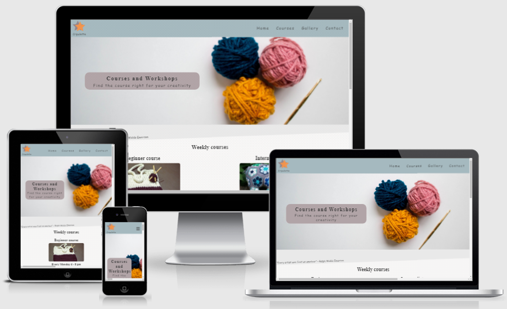
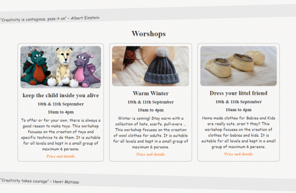

<h1 align="center"> Project 1 for Code Institute formation | Cripullette crochet - HTML & CSS</h1>

[View the live project here.](https://laurepiechaczyk.github.io/project1_code_institute_Laure_Piechaczyk/)

Cripulette Crochet is a website built as part of a project for code institute (formation to become a webdeveloper) in order to developp and show my skills in HTML and CSS. 

To do this, I invented a small business that offers courses and workshops to learn crochet.

<h2 align="center"></h2>

# Table of content

# About the project 
In order to practice, developp and show my skills in HTML and CSS, I created the responsive Cripulette crochet website. Cripulette Crochet is an invented small business that offers courses and workshops to learn crochet. 
I have choosen this theme because I myself do crochet and deeply beleive that in our world where computers are omnipresent, we should all allow ourselves some time to do manual creations. 

Nevertheless, the main objective of this website is to practice with HTML and CSS. For this reason, I made the decision to use almost exclusivelly this 2 languages. I also choose to avoid the use of Bootstrap because I wanted to learn and consolidate my ability to write CSS code and to control all elements. I did use a bit of Javascript for some features but focused in HTML and CSS.

# The target audience
The target audience of Cripulette Crochet are adults crocheting or wanting to learn crochet. The offer in the website are Courses and Worshops to learn and improve to crochet as well as getting new inspirations by making creations on various themes.

I expect this site to be exchanged a lot between "crochetists" by sending the link to each other because word of mouth is important among crocheters. Nevertheless, the site is also for people looking for crochet lessons / workshops in their neighborhood even without knowing anyone.

# User Experience (UX)

-   ### User stories
    The targeted users are adults that like doing manual work including crochet, knitting and sewing. They are likelly to have some of the following characteristics:
    1. They like to create and express themself through small pieces of ownmade art.
    2. They are persistent in their work and are not afraid to spend time on a project to finish it.
    3. They are patient and enjoy spending hours making activities in a quiet environment. 
    4. They have the will to improve their skills. 
    5. They are enthousiastic to meet other persons sharing the same hobby. 
    6. they like or need to cut themself from the digital world. 

    This last point made me raised an interresting question: How attracting people that might want to avoid media by using media? 

    I thus build the website keeping in mind this question and made design choices 
    which seemed relevant to allow users to feel in a calm and cosy environment while browsing the website

    -   #### Visitor Goals

        1. To feel calm and stay relax.
        2. Find the offers / information rapidly.
        3. Get motivation and inspiration even if the user to not enroll in a course
        4. That the user like the website and offers enough to share it with friends. 

-   ### Main design choices
    -   ####  Theme Colors
        Theme colors were inspirided from palettes that offer a calm feeling (details in credits) while stimulating the curiosity and thus the creativity by adding a Yellow-Orange color. This last color was inspired by the color of a ball of wool present in the cover picture.

     -   ####   Background
         A picture for the background was added to give a 3D feelling and to give the sensation that the bacground could be touched. I explect that many of the users like to touch tissues and surfaces and thus I added a background that gives this sensation.
        For a visual cohesion, the image was also used for the headings and footer and colors on top were 0.7 transparent to permit a subtil visualisation of the background image.
            
     -   ####   Pictures
         1. Homepage
        For the design of the homepage, I wanted to focus on the process of creation and not on a final creation. That is why I have chosen pictures showing wool, crochets and the process of doing crochet.
        The reason is that I did not want to influence the imagination of the useron the homepage.
         2. Courses and Workshops
        For this page, I tried to choose pictures that illustrate the course and Worshop offered. 
         3. Gallery
        I have tried to illustrate the diversity of creations that can be made with crochet as well as different technical levels of creations. As I have been using open source images, I was limited in the picture I could use and do beleive the diversity of crochet could have been illustrated in a better way.

     -    ### Fonts
          Google fonts where used for the fonts of the website. 
        'Sacramento' was chosen for the body's font because it gives a feeling a hand writing which is, I presumed, attractive for people looking for manual activities. 
        'Josefin Slab' was chosen for the titles because it was a popular pairing suggested in google font website and I found the combinaison of these 2 fonts pleasant. Moreover, this combinaison gives in my opinion, a clean look with an artistic touch.

    -    ### Text
    In the home page The text in different screen size has modifications because I wanted that people get a

    -   ####   Interactivity, Animations and Geometrical forms
        In purpose, few interactivity and animations were added in the website in order to keep it simple and relaxing. Some forms with sentences from famous artist were displayed in non straight position to attract the attention of the reading but otherwise the website was kept simple.

    -   ####   Border-radius
        Border-radius were rounded to give a sensation of tranquility.

## Wireframes
to add a link here

# Features 
The website is structured in 4 webpages with possibilities to easelly navigate from one to another. Some links have been strategically displayed to reach relevant subsections on webpage (example: button Weekly course on the Home page)
 -   ####   Responsivness
The website is designed to be responsive to all devices. AS an example the responsive navbar collaps into a burger button for screens under ...px.

<h2 align="center"></h2>

  -   ####   Animations
  For design reasons, there are very few animations on this website. To facilitate the user's navigation, the background colour and the padding of the navbar links change when the mouse is over them.
  <h2 align="center"></h2>
  
  @keyframe was used to change the background color of buttons for price and details in the courses webpage.

  -   ####   Position of elements & geometric forms
  Care was made to position the elements in the different sizes of the screens. Also in the page Courses and worshop, geometrical forms containing famous quotes were used as separations between the sections.
   <h2 align="center"></h2>

 -    ### Text content depending on the size 
 In the home page, the text is different depending on the screen size. This choice was made to offer more complete informations for the person using computer while allowing the persons using a phone to focus on the main informations.
    

## Technologies Used

### Languages Used

-   [HTML5](https://en.wikipedia.org/wiki/HTML5)
-   [CSS3](https://en.wikipedia.org/wiki/Cascading_Style_Sheets)  
-   [js](https://en.wikipedia.org/wiki/JavaScript)  

### Frameworks, Libraries & Programs Used

- [Google Fonts](https://fonts.google.com/) | used to  import the 'Sacramento' and 'Josefin Slab' fonts.

- [Font Awesome](https://fontawesome.com/) | used to add icons representing. social media in the footer.

- [Git](https://git-scm.com/) | used as version control system.

- [Gitpod](https://gitpod.io/workspaces) | used to code, commit to git and push the codes to github.

- [GitHub](https://github.com/) | used to store the project code, show it and deploy the website

- [Balsamiq](https://balsamiq.com/) |  used to create the wireframe.

- [Inkscape](https://inkscape.org/) | used to create the logo

- [Spark.adobe](https://spark.adobe.com/tools/image-resize/) | used to resized pictures

- [Powerpoint](https://simple.wikipedia.org/wiki/Microsoft_PowerPoint) | used to create images from screenshots.

- [Word](https://en.wikipedia.org/wiki/Microsoft_Word) | used to correct the grammar (not yet)

- [am I responsive?](http://ami.responsivedesign.is/) | used to look at the responsvness of the website and to present an introductary picture in the readme file.

- [W3C Markup Validation Service](https://validator.w3.org/) | used to check the validity of the HTML code.

- [W3C CSS Validation service](https://jigsaw.w3.org/css-validator/) | used to check the validity of the CSS code.

- [Colorrrs](https://www.webfx.com/web-design/hex-to-rgb/) | used to convert hex color to rgb color.

- [Chrome DevTools](https://developer.chrome.com/docs/devtools/) | used to inpect the elements, codes and to see the how the site look like on various phones and tabletts

- [Clippy](https://bennettfeely.com/clippy/) | used to get rapidly codes to design forms with clip-path.

# Credits
## Inspiration credits
- ### Theme Colors
Theme colors were inspirided from the palettes: [Del Rio Gray Iceberg Powder Blue Color Palette](https://colorideas.net/del-rio-gray-iceberg-powder-blue-color-palette/) and [iColorpalette](https://icolorpalette.com/imagepalette/color-palette-ideas-from-horizon-sky-shore-image-2).

This palettes inspired me because they gives an overall sensation of calm and the addition of the orange color stimulates the curiosity and thus the creativity.

- ### Sections of the webpage
The section "4 good reasons to learn crochet" and the gallery were inspired from a walkthrought project made with [code institute](https://codeinstitute.net/) called love running.

## Code credits
[code institute](https://codeinstitute.net/) - parts of codes over the entire website have been adapted from the courses and the walkthrought project called love running.

[Udemy course by Enzo Ustariz](https://www.skillshare.com/classes/10-techniques-%C3%A0-conna%C3%AEtre-en-CSS/2090817304) - some code to position elements have been adapted from this course.

[w3schools](https://www.w3schools.com/) - Used through the entire project. The burger responsive menu is a  code adapted from
[howto_js_mobile_navbar](https://www.w3schools.com/howto/howto_js_mobile_navbar.asp).

[stakocverflow](https://stakocverflow.com/) - Used through the entire project.

## Pictures credits
Three_balls_wool. Picture from unsplash by Karen Penroz. 
Kid_slipper. Picture from Pixabay by sato1mo.
Bag-beginner: Pixabay by xxolaxx 
rinoceros intermediaire: Pixabay by leoleobobeo
dragon for kkep the child inside you: pixabay by holmespj
Teddy bears : Picture from pixabay by congerdesign
Hat: picture from unsplash by Dana
## General websites credits

citations: https://artcenter-nnj.org/10-famous-quotes-about-art/

# Tests

# Deployment

# What could have been made better

# Conclusion

# Acknowlegments